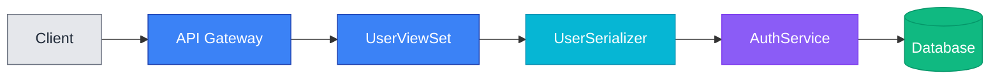
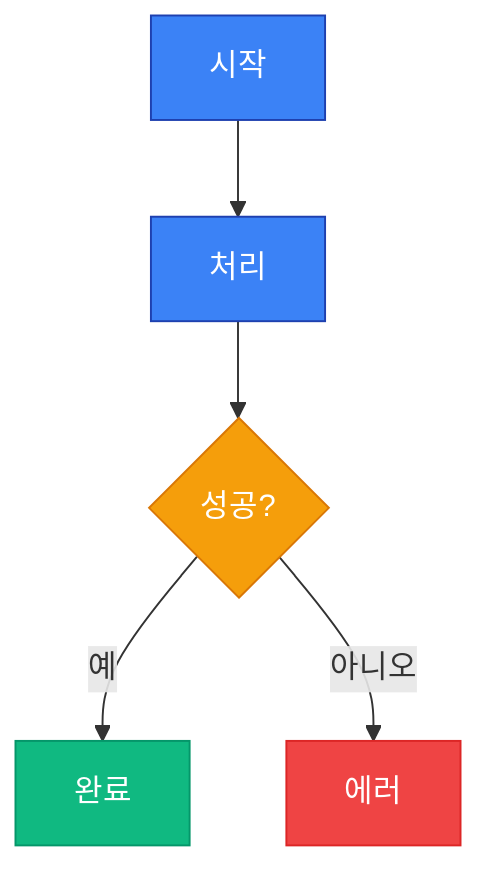

# Platform Dev Team Claude Plugin 🛠️

플랫폼 개발팀 공식 Claude 플러그인입니다. TDD 가이드, 적극적인 문서 관리, Mermaid 차트 시각화를 통한 자동화된 PR 관리를 제공합니다.

> **📌 라이선스**: datamaker-kr organization 멤버 전용 - [라이선스 상세 내용](#라이선스)

## 개요

이 플러그인은 Django, FastAPI, Express, React, Vue 등 다양한 프레임워크를 다루는 개발팀을 위한 전문 스킬과 커맨드로 Claude Code를 강화합니다. 프로젝트 타입을 자동으로 감지하여 적절한 용어와 가이드를 제공합니다.

**소속 조직**: [datamaker-kr](https://github.com/datamaker-kr)

### 대상 프로젝트

- **synapse-backend**: 주요 백엔드 API 서버
- **synapse-workspace**: 워크스페이스 관리 서비스
- **synapse-annotator**: 어노테이션 서비스

### 주요 기능

- **테스트 주도 개발**: Kent Beck의 TDD 방법론과 Tidy First 원칙 적용
- **적극적인 문서 관리**: 문서 업데이트가 필요한 시점을 자동으로 감지
- **PR 관리**: PR 제목과 포괄적인 설명을 자동 생성
- **Mermaid 차트**: 엄격한 규칙을 따르는 라이트/다크 모드 호환 다이어그램 생성
- **이중 언어 지원**: 모든 커맨드에서 한국어와 영어 지원

## 설치

> **⚠️ 중요**: 이 플러그인은 **datamaker-kr organization 멤버 전용**입니다. 조직 멤버가 아닌 경우 사용이 제한됩니다.

### 사전 요구사항

#### 1. datamaker-kr Organization 멤버십

본 플러그인은 datamaker-kr organization 멤버 전용입니다. 조직 멤버가 아닌 경우 접근이 제한됩니다.

#### 2. Claude Code CLI 설치

Claude Code CLI가 설치 및 구성되어 있어야 합니다.

#### 3. Node.js와 npm 설치

GitHub MCP 서버 실행을 위해 Node.js와 npm이 필요합니다.

```bash
# 설치 확인
node --version
npm --version
```

#### 4. GitHub Personal Access Token 설정

**4-1. GitHub Token 생성**

1. GitHub Settings → Developer settings → Personal access tokens → Tokens (classic)로 이동
2. "Generate new token (classic)" 클릭
3. 다음 권한 선택:
   - ✅ `repo` (비공개 저장소 전체 제어)
   - ✅ `pull_requests` (Pull Request 읽기 및 쓰기)
4. 토큰 생성 후 안전한 곳에 저장

**4-2. 환경 변수 설정**

```bash
# 쉘 프로필에 추가 (~/.bashrc, ~/.zshrc 등)
export GITHUB_TOKEN="your_github_token_here"

# 프로필 다시 로드
source ~/.zshrc  # 또는 source ~/.bashrc
```

**4-3. 설정 확인**

```bash
# 토큰이 설정되었는지 확인
echo $GITHUB_TOKEN
```

---

### 방법 1: GitHub에서 직접 설치 (권장)

GitHub 저장소에서 직접 플러그인을 설치하는 가장 간단한 방법입니다.

#### 1단계: 플러그인 설치

```bash
/plugin install https://github.com/datamaker-kr/platform-dev-team-claude-plugin.git
```

#### 2단계: 설치 확인

```bash
/plugin list
/platform-dev-team-claude-plugin:update-pr-title --help
```

✅ **성공 시**: 사용 가능한 커맨드 도움말이 표시됩니다.

#### 플러그인 업데이트

```bash
/plugin update platform-dev-team-claude-plugin
```

💡 플러그인이 업데이트되면 자동으로 최신 기능과 버그 수정이 반영됩니다.

---

### 방법 2: 수동 설치 (개발자용)

플러그인 개발이나 커스터마이징이 필요한 경우 수동 설치를 사용하세요.

#### 1단계: 저장소 클론

```bash
# 플러그인 저장소 클론
git clone https://github.com/datamaker-kr/platform-dev-team-claude-plugin.git
cd platform-dev-team-claude-plugin
```

#### 2단계: 플러그인 디렉토리 연결

**방법 A: 심볼릭 링크 생성 (권장)**

```bash
# Claude Code 플러그인 디렉토리에 심볼릭 링크 생성
ln -s $(pwd) ~/.claude/plugins/platform-dev-team
```

**방법 B: 디렉토리 복사**

```bash
# Claude Code 플러그인 디렉토리로 복사
cp -r . ~/.claude/plugins/platform-dev-team
```

#### 3단계: Claude Code 재시작

```bash
# Claude Code 재시작하여 플러그인 로드
# IDE를 재시작하거나 Claude Code를 다시 실행
```

#### 4단계: 설치 확인

```bash
# 플러그인 목록 확인
/plugin list

# 커맨드 테스트
/platform-dev-team:update-pr-title --help
```

#### 플러그인 업데이트 (수동 설치)

```bash
# 플러그인 디렉토리로 이동
cd ~/.claude/plugins/platform-dev-team

# 또는 원본 클론 디렉토리로 이동
cd /path/to/platform-dev-team-claude-plugin

# 최신 버전 가져오기
git pull origin main
```

---

### MCP 서버 구성 확인

플러그인에는 GitHub MCP 서버 구성이 포함된 `.mcp.json`이 있습니다.

**확인 사항**:
- ✅ `GITHUB_TOKEN` 환경 변수가 설정되어 있는지 확인
- ✅ Node.js/npm이 설치되어 있는지 확인
- ✅ Claude Code가 MCP 서버를 시작할 수 있는지 확인

**MCP 서버 상태 확인**:

```bash
# MCP 서버 연결 상태 확인
/mcp status

# 또는 수동으로 GitHub MCP 서버 테스트
npx -y @modelcontextprotocol/server-github
```

## 다른 프로젝트에서 사용하기

본 플러그인을 여러 프로젝트(synapse-backend, synapse-workspace, synapse-annotator 등)에서 사용하는 방법을 안내합니다.

### 옵션 1: Claude Code 마켓플레이스 (권장)

**전역 설치로 모든 프로젝트에서 자동으로 사용 가능**

Claude Code 마켓플레이스를 통해 설치하면 별도의 프로젝트별 설정 없이 모든 프로젝트에서 자동으로 플러그인을 사용할 수 있습니다.

**장점**:
- ✅ 모든 프로젝트에서 자동으로 사용 가능
- ✅ 업데이트 자동 적용
- ✅ 프로젝트별 설정 불필요
- ✅ 가장 간편한 방법

**단점**:
- ❌ 프로젝트별로 다른 버전 사용 불가

**설치 방법**:
```bash
# Claude Code에서 설치
/plugin marketplace install platform-dev-team

# 모든 프로젝트에서 바로 사용 가능
cd ~/Projects/synapse-backend
/platform-dev-team:update-pr-title --help
```

---

### 옵션 2: Git Submodule (팀 프로젝트용)

**프로젝트별로 독립적인 버전 관리**

각 프로젝트에 플러그인을 submodule로 추가하여 프로젝트별로 다른 버전을 사용하거나 팀원들과 동일한 버전을 공유할 수 있습니다.

**장점**:
- ✅ 프로젝트별 독립적인 버전 관리
- ✅ Git 히스토리에 플러그인 버전이 명시적으로 기록됨
- ✅ 팀원들이 같은 버전의 플러그인 사용 보장
- ✅ 프로젝트별로 다른 버전 사용 가능

**단점**:
- ❌ 수동 업데이트 필요
- ❌ Submodule 관리의 복잡성
- ❌ 각 프로젝트마다 별도로 추가해야 함

**설치 방법**:

```bash
# 프로젝트 저장소로 이동
cd ~/Projects/synapse-backend

# Git submodule로 플러그인 추가
git submodule add https://github.com/datamaker-kr/platform-dev-team-claude-plugin.git .claude-plugins/platform-dev-team

# Submodule 초기화 및 업데이트
git submodule update --init --recursive

# 변경사항 커밋
git add .gitmodules .claude-plugins/platform-dev-team
git commit -m "docs: Add platform-dev-team Claude plugin as submodule"

# 플러그인 활성화 확인
/plugin list
```

**다른 팀원이 클론한 경우**:

```bash
# 저장소 클론 시 submodule도 함께 클론
git clone --recurse-submodules https://github.com/datamaker-kr/synapse-backend.git

# 또는 이미 클론한 경우
git submodule update --init --recursive
```

**업데이트 방법**:

```bash
# 프로젝트 디렉토리에서
cd ~/Projects/synapse-backend

# Submodule 디렉토리로 이동
cd .claude-plugins/platform-dev-team

# 최신 버전으로 업데이트
git fetch origin
git checkout v2026.1.2  # 또는 원하는 버전

# 상위 디렉토리로 돌아가서 변경사항 커밋
cd ../..
git add .claude-plugins/platform-dev-team
git commit -m "docs: Update platform-dev-team plugin to v2026.1.2"
```

---

### 옵션 3: 심볼릭 링크 (개발자용)

**하나의 플러그인 복사본을 여러 프로젝트에서 공유**

플러그인 개발이나 테스트 시 유용합니다. 하나의 플러그인 복사본을 여러 프로젝트에서 공유하여 수정사항이 즉시 모든 프로젝트에 반영됩니다.

**장점**:
- ✅ 여러 프로젝트에서 하나의 플러그인 복사본 공유
- ✅ 플러그인 수정 시 모든 프로젝트에 즉시 반영
- ✅ 플러그인 개발 및 테스트에 최적
- ✅ 디스크 공간 절약

**단점**:
- ❌ 심볼릭 링크는 Git에 커밋되지 않음 (팀원들과 공유 불가)
- ❌ 각 개발자가 로컬에서 직접 설정 필요
- ❌ 한 프로젝트에서의 변경이 모든 프로젝트에 영향

**설치 방법**:

```bash
# 플러그인 개발 디렉토리 클론 (한 번만)
git clone https://github.com/datamaker-kr/platform-dev-team-claude-plugin.git ~/dev/platform-dev-team-plugin

# 각 프로젝트에서 심볼릭 링크 생성
cd ~/Projects/synapse-backend
mkdir -p .claude-plugins
ln -s ~/dev/platform-dev-team-plugin .claude-plugins/platform-dev-team

cd ~/Projects/synapse-workspace
mkdir -p .claude-plugins
ln -s ~/dev/platform-dev-team-plugin .claude-plugins/platform-dev-team

cd ~/Projects/synapse-annotator
mkdir -p .claude-plugins
ln -s ~/dev/platform-dev-team-plugin .claude-plugins/platform-dev-team

# 플러그인 활성화 확인
/plugin list
```

**업데이트 방법**:

```bash
# 원본 플러그인 디렉토리에서 업데이트
cd ~/dev/platform-dev-team-plugin
git pull origin main

# 모든 프로젝트에 즉시 반영됨
```

---

### 옵션 4: Git Worktree (고급 사용자용)

**플러그인의 여러 브랜치를 동시에 작업**

Git worktree는 플러그인 관리보다는 플러그인 개발에 유용합니다. 플러그인 저장소의 여러 브랜치를 동시에 작업할 때 사용합니다.

**장점**:
- ✅ 여러 브랜치를 동시에 작업 가능
- ✅ 브랜치 전환 없이 다른 버전 테스트
- ✅ 플러그인 개발 워크플로우 최적화

**단점**:
- ❌ Git worktree 개념에 대한 이해 필요
- ❌ 일반 사용자에게는 복잡함
- ❌ 주로 플러그인 개발자용

**사용 시나리오**:
- 플러그인의 새 기능을 개발하면서 동시에 안정 버전도 유지
- 여러 버전의 플러그인을 서로 다른 프로젝트에서 테스트
- 플러그인 기여 시 메인 브랜치와 기능 브랜치를 동시에 관리

**설치 방법**:

```bash
# 플러그인 메인 저장소
cd ~/dev/platform-dev-team-plugin

# 새로운 기능 개발을 위한 worktree 생성
git worktree add ../platform-dev-team-plugin-feature-x feature-x

# feature-x 브랜치에서 작업
cd ../platform-dev-team-plugin-feature-x
# 개발 작업...

# 테스트를 위해 프로젝트에 링크
cd ~/Projects/synapse-backend
mkdir -p .claude-plugins
ln -s ~/dev/platform-dev-team-plugin-feature-x .claude-plugins/platform-dev-team

# 다른 프로젝트에서는 안정 버전 사용
cd ~/Projects/synapse-workspace
mkdir -p .claude-plugins
ln -s ~/dev/platform-dev-team-plugin .claude-plugins/platform-dev-team
```

**Worktree 관리**:

```bash
# Worktree 목록 확인
git worktree list

# Worktree 삭제
git worktree remove ../platform-dev-team-plugin-feature-x
```

---

### 권장 사항

프로젝트 유형과 사용 목적에 따라 적절한 옵션을 선택하세요:

#### 일반 사용자 (synapse-backend, synapse-workspace 등에서 플러그인 사용)

→ **옵션 1: Claude Code 마켓플레이스** 사용 권장

가장 간편하고 유지보수가 쉽습니다. 모든 프로젝트에서 자동으로 최신 버전을 사용할 수 있습니다.

#### 팀 프로젝트 (특정 플러그인 버전 고정 필요)

→ **옵션 2: Git Submodule** 사용 권장

팀원들이 모두 같은 버전의 플러그인을 사용하도록 보장합니다. 프로젝트별로 다른 버전을 사용할 수 있습니다.

#### 플러그인 개발자 (플러그인 수정 및 테스트)

→ **옵션 3: 심볼릭 링크** 또는 **옵션 4: Git Worktree** 사용 권장

플러그인 개발 시 여러 프로젝트에서 동시에 테스트할 수 있습니다. Git worktree는 여러 브랜치를 동시에 작업할 때 유용합니다.

---

## 아키텍처

본 플러그인은 **에이전트(Agents)**와 **스킬(Skills)**이라는 두 가지 주요 컴포넌트로 구성됩니다.

### 에이전트 vs 스킬

#### 에이전트 (Orchestrators)

복잡한 워크플로우를 수행하기 위해 여러 스킬과 커맨드를 조율하는 오케스트레이터입니다.

**특징**:
- ✅ 다단계 워크플로우 관리
- ✅ 다른 스킬/커맨드 호출
- ✅ 사용자 승인 대기
- ✅ 통합된 결과 제시

**에이전트 목록**:
- **docs-manager**: 문서 관리 워크플로우 조율 (docs-analyzer → docs-bootstrapper → mermaid-expert)
- **update-pr**: PR 업데이트 조율 (update-pr-title + update-pr-desc)
- **planner**: 4단계 구현 계획 프로세스 조율

#### 스킬 (Workers)

단일 책임을 가진 전문 작업자로, 독립적으로 사용되거나 에이전트에 의해 호출됩니다.

**특징**:
- ✅ 단일 초점 작업
- ✅ 독립 실행 가능
- ✅ 직접 실행
- ✅ 구체적인 출력

**스킬 목록**:
- **docs-analyzer**: 코드 및 문서 갭 분석
- **docs-bootstrapper**: 초기 문서 구조 생성
- **mermaid-expert**: Mermaid 다이어그램 생성 (색상 규칙 준수)
- **commit-with-message**: 커밋 메시지 규칙 적용
- **tdd-workflow**: TDD 방법론 가이드

### 디렉토리 구조

```
platform-dev-team-claude-plugin/
├── agents/                    # 오케스트레이터 에이전트
│   ├── docs-manager/          # 문서 관리 워크플로우
│   ├── update-pr/             # PR 업데이트 워크플로우
│   └── planner/               # 구현 계획 프로세스
├── skills/                    # 전문 작업자 스킬
│   ├── docs-analyzer/         # 문서 갭 분석
│   ├── docs-bootstrapper/     # 문서 부트스트랩
│   ├── mermaid-expert/        # 다이어그램 생성
│   ├── commit-with-message/        # 커밋 메시지 규칙
│   └── tdd-workflow/          # TDD 가이드
└── commands/                  # Claude 커맨드
    ├── update-pr-title.md
    ├── update-pr-desc.md
    └── update-docs.md
```

---

## 에이전트

본 플러그인은 3가지 오케스트레이터 에이전트를 제공합니다.

### 1. docs-manager Agent

**포괄적인 문서 관리를 위한 오케스트레이터 에이전트**

- **활성화**: 적극적 (코드 변경 자동 모니터링) 또는 수동 (/update-docs)
- **워크플로우**: docs-analyzer → docs-bootstrapper → mermaid-expert 조율
- **핵심 기능**: 서브 스킬 조율, 통합 리포트 생성, 승인된 업데이트 적용
- **트리거**: API 변경, 모델 변경, 아키텍처 변경 시

📖 [docs-manager Agent 상세 가이드](agents/docs-manager/README.md)

### 2. update-pr Agent

**PR 제목과 설명을 한 번에 업데이트하는 통합 워크플로우**

- **활성화**: 사용자 요청 시 수동
- **워크플로우**: update-pr-title + update-pr-desc 명령어 실행
- **프로젝트 인식**: Django, FastAPI, React, Vue 등 자동 감지 및 적응
- **선택적 업데이트**: 제목만, 설명만, 또는 둘 다 업데이트 가능

📖 [update-pr Agent 상세 가이드](agents/update-pr/README.md)

### 3. planner Agent

**포괄적이고 실행 가능한 구현 계획 수립 전문가**

- **활성화**: 복잡한 기능 구현, 아키텍처 변경, 리팩토링 요청 시
- **핵심 기능**: 요구사항 분석, 아키텍처 검토, 단계별 분해, 의존성 식별
- **계획 프로세스**: 4단계 (요구사항 분석 → 아키텍처 검토 → 단계별 분해 → 구현 순서)
- **출력**: 상세한 구현 계획 (파일 경로, 복잡도, 위험, 테스트 전략 포함)
- **통합**: tdd-workflow, docs-manager, commit-with-message, update-pr와 연계

📖 [planner Agent 상세 가이드](agents/planner/README.md)

---

## 스킬

본 플러그인은 6가지 전문 스킬을 제공합니다. 각 스킬의 상세 가이드는 개별 README를 참조하세요.

### 1. TDD Workflow

**Kent Beck의 TDD 및 Tidy First 방법론을 따르는 개발 가이드**

- **활성화**: 개발 세션 중 자동
- **핵심 원칙**: Red → Green → Refactor 사이클
- **특징**: 테스트 우선 개발, 구조적/행동적 변경 분리

📖 [TDD Workflow 상세 가이드](skills/tdd-workflow/README.md)

### 2. docs-analyzer Skill

**코드 변경사항 분석 및 문서 갭 식별**

- **활성화**: docs-manager에 의해 호출 또는 독립 실행
- **핵심 기능**: Git 히스토리 분석, 기존 문서 카탈로그, 구조화된 갭 리포트 생성
- **출력**: 우선순위별 문서 갭 리스트 및 권장사항

📖 [docs-analyzer Skill 상세 가이드](skills/docs-analyzer/README.md)

### 3. docs-bootstrapper Skill

**프로젝트 문서 구조 부트스트랩**

- **활성화**: docs-manager에 의해 호출 또는 독립 실행
- **핵심 기능**: 프로젝트 타입 자동 감지, 템플릿 기반 문서 생성
- **생성 파일**: README.md, docs/architecture.md, docs/api.md (백엔드)
- **지원 프로젝트**: Django, FastAPI, React, Vue, Terraform, Kubernetes 등

📖 [docs-bootstrapper Skill 상세 가이드](skills/docs-bootstrapper/README.md)

### 4. mermaid-expert Skill

**라이트/다크 모드 호환 Mermaid 다이어그램 전문 생성**

- **활성화**: 수동 호출 또는 다른 스킬에서 호출
- **지원 다이어그램**: API 흐름, ER 다이어그램, 플로우차트, 시퀀스, 상태 다이어그램
- **색상 규칙**: 의미론적 색상, 순수 검정/흰색 금지
- **통합**: docs-manager, docs-bootstrapper, update-pr-desc에서 호출

📖 [mermaid-expert Skill 상세 가이드](skills/mermaid-expert/README.md)

### 5. commit-with-message Skill

**한글/영어 커밋 메시지 작성 규칙 자동 적용**

- **활성화**: 커밋 생성 시 자동
- **언어 지원**: 한글(기본), 영어 선택 가능
- **기능**: 커밋 타입 자동 선택, 72자 제한, Co-Authored-By 추가

📖 [commit-with-message Skill 상세 가이드](skills/commit-with-message/README.md)

### 6. changelog-manager Skill

**CHANGELOG.md 관리 및 변경 이력 자동 생성**

- **활성화**: `/add-changelog` 커맨드로 호출
- **형식**: Keep a Changelog 준수, CalVer (YYYY.MM.MICRO) 버전 관리
- **핵심 기능**: Git 커밋 분석, 티켓 ID 자동 추출, 한글/영어 지원
- **카테고리**: Added, Changed, Fixed, Deprecated, Removed, Security

📖 [changelog-manager Skill 상세 가이드](skills/changelog-manager/README.md)

---

## 커맨드

### /update-pr-title

커밋과 변경사항을 기반으로 PR 제목을 자동 생성합니다.

**사용법**:

```bash
/update-pr-title                    # 현재 브랜치 사용, 한국어 제목
/update-pr-title --pr 123           # 특정 PR, 한국어 제목
/update-pr-title --lang eng         # 영어 제목
/update-pr-title --pr 123 --lang ko # 특정 PR, 한국어 제목
```

**기능**:

- 커밋 메시지와 변경된 파일 분석
- PR 타입 감지 (feat, fix, refactor 등)
- 티켓 ID 보존 (SYN-1234, #123)
- 제목을 72자 이하로 유지
- 이중 언어 지원 (한국어/영어)

**출력 예시**:

```
✅ Updated PR #156 title:
[SYN-1234] 기능: 사용자 JWT 인증 시스템 구현
```

### /update-pr-desc

프로젝트 타입을 자동으로 감지하여 필수 Mermaid 차트를 포함한 포괄적인 PR 설명을 생성합니다.

**사용법**:

```bash
/update-pr-desc                              # 현재 브랜치, 한국어
/update-pr-desc --pr 123                     # 특정 PR, 한국어
/update-pr-desc --lang eng                   # 영어 설명
/update-pr-desc --include-load-test          # 로드 테스트 결과 포함
/update-pr-desc --pr 123 --lang ko --include-load-test  # 모든 옵션
```

**기능**:

- **프로젝트 타입 자동 감지**: Django, FastAPI, Express, React, Vue, Angular, Terraform, Kubernetes 등
- **프로젝트별 콘텐츠 적응**: 각 프레임워크에 맞는 용어, 예시, Mermaid 차트 자동 생성
- 엄격한 PR 템플릿 구조 준수
- 변경사항 시각화를 위한 **필수 Mermaid 차트**
- PR 타입 자동 감지 (Bug Fix, Feature, Refactoring 등)
- 모든 필수 섹션 생성:
  - PR 타입
  - 변경 사항 개요
  - **변경 사항 시각화 (Mermaid 차트 포함)**
  - 관련 이슈
  - 테스트
  - Breaking Changes
- 선택적 섹션 (해당되는 경우만):
  - API 변경 사항
  - 성능 영향
  - 배포 시 주의사항
  - 리뷰어 체크리스트

**생성되는 Mermaid 차트 예시**:



**템플릿 준수**:

- 모든 생성된 설명은 `.github/pull_request_template.md`를 따름
- 필수 섹션은 절대 생략되지 않음
- 선택적 섹션은 관련이 있을 때만 포함

### /update-docs

문서 분석 및 업데이트를 수동으로 트리거합니다.

**사용법**:

```bash
/update-docs                        # 전체 저장소 스캔
/update-docs --scope apps/users     # 특정 디렉토리로 제한
/update-docs --since abc123f        # 특정 커밋 이후 분석
```

**기능**:

- 저장소에서 마크다운 파일 스캔
- 최근 코드 변경사항 분석
- 오래된 문서 식별
- 아키텍처 변경에 대한 Mermaid 차트 생성
- 업데이트 전 권장사항 제시
- 사용자 승인 후 문서 업데이트

**보고서 예시**:

```markdown
# 문서 업데이트 권장사항

## 감지된 변경사항

- 인증 엔드포인트가 포함된 UserViewSet 추가
- UserProfile 모델 생성
- Order 모델 수정

## 영향을 받는 문서

1. README.md (⚠️ 오래됨)
   - 새로운 환경 변수 필요
2. docs/api-documentation.md (⚠️ 불완전)
   - 인증 엔드포인트 누락
3. docs/architecture.md (⚠️ 오래됨)
   - ER 다이어그램에 UserProfile 모델 없음

## 제안된 Mermaid 차트

- 인증 흐름 다이어그램
- 업데이트된 데이터 모델 ER 다이어그램

업데이트를 진행할까요? (yes/no/customize)
```

### /add-changelog

CHANGELOG.md에 변경 이력을 자동으로 추가합니다.

**사용법**:

```bash
/add-changelog                              # Added 카테고리, 한글 (기본값)
/add-changelog --type fixed                 # Fixed 카테고리, 한글
/add-changelog --type changed --lang eng    # Changed 카테고리, 영어
/add-changelog --ticket SYN-1234            # 티켓 ID 수동 지정
```

**옵션**:

- `--type <category>`: Changelog 카테고리
  - `added` (기본값): 새로운 기능
  - `changed`: 기존 기능 변경/개선
  - `fixed`: 버그 수정
  - `deprecated`: 지원 중단 예정
  - `removed`: 제거된 기능
  - `security`: 보안 수정
- `--lang <language>`: 설명 언어
  - `korean` 또는 `ko` (기본값): 한국어
  - `english` 또는 `eng`: 영어
- `--ticket <id>`: 티켓 ID (선택사항, 브랜치 이름에서 자동 추출)

**기능**:

- Git 커밋 및 변경사항 자동 분석
- 브랜치 이름에서 티켓 ID 자동 추출
- Keep a Changelog 형식 자동 준수
- CalVer (YYYY.MM.MICRO) 버전 관리
- Unreleased 섹션에 자동 추가
- JIRA 티켓 링크 자동 생성

**예시**:

```markdown
## [Unreleased] - 2026-01-19

### Added
- [SYN-1234](https://jira.example.com/browse/SYN-1234) JWT 기반 사용자 인증 시스템 추가

### Fixed
- [SYN-1250](https://jira.example.com/browse/SYN-1250) 로그인 시 세션 만료 오류 수정
```

## 구성

### 플러그인 구조

```
platform-dev-team-claude-plugin/
├── .claude-plugin/
│   └── plugin.json           # 플러그인 메타데이터와 마켓플레이스 정보
├── .mcp.json                 # GitHub MCP 서버 구성
├── commands/
│   ├── update-pr-title.md    # PR 제목 생성 커맨드
│   ├── update-pr-desc.md     # PR 설명 생성 커맨드
│   └── update-docs.md        # 문서 업데이트 커맨드
├── skills/
│   ├── tdd-workflow/
│   │   ├── SKILL.md          # TDD 가이드 워크플로우
│   │   └── README.md         # TDD 워크플로우 상세 가이드
│   ├── docs-manager/
│   │   ├── SKILL.md          # 문서 관리 스킬
│   │   ├── mermaid-guidelines.md  # Mermaid 차트 규칙
│   │   └── README.md         # docs-manager 스킬 상세 가이드
│   ├── mermaid-expert/
│   │   ├── SKILL.md          # Mermaid 다이어그램 생성 스킬
│   │   └── README.md         # mermaid-expert 스킬 상세 가이드
│   └── commit-with-message/
│       ├── SKILL.md          # 커밋 메시지 작성 스킬
│       └── README.md         # commit-with-message 스킬 상세 가이드
├── CLAUDE.md                 # Claude 작업 가이드 (커밋 메시지 규칙 등)
├── specs/                    # 명세 문서 (gitignored)
└── README.md                 # 이 파일
```

### MCP 서버 구성

`.mcp.json` 파일은 GitHub MCP 서버를 구성합니다:

```json
{
  "mcpServers": {
    "github": {
      "command": "npx",
      "args": ["-y", "@modelcontextprotocol/server-github"],
      "env": {
        "GITHUB_PERSONAL_ACCESS_TOKEN": "${GITHUB_TOKEN}"
      }
    }
  }
}
```

서버는 Claude Code가 플러그인을 로드할 때 자동으로 시작됩니다.

## Mermaid 차트 규칙

이 플러그인이 생성하는 모든 Mermaid 차트는 라이트/다크 모드 호환성을 위한 엄격한 규칙을 따릅니다.

### 핵심 규칙

- ✅ 모든 차트는 라이트 테마와 다크 테마 모두에서 보여야 함
- ❌ 절대 순수 검정 (#000000) 또는 순수 흰색 (#FFFFFF) 사용 금지
- ✅ 의미론적 색상 사용 (초록=성공, 빨강=에러)
- ✅ 모든 노드에 스타일 지시어 포함

### 예시



전체 가이드라인은 [skills/docs-manager/mermaid-guidelines.md](skills/docs-manager/mermaid-guidelines.md)를 참조하세요.

## 버전 관리

이 플러그인은 **CalVer (Calendar Versioning)** 체계를 따릅니다.

### 버전 형식: YYYY.Minor.Patch

- **YYYY**: 릴리스 연도 (예: 2026, 2027)
- **Minor**: 해당 연도 내 기능 추가 및 개선 (0부터 시작)
- **Patch**: 버그 수정 및 문서 업데이트 (0부터 시작)

### 버전 증가 규칙

**연도 (YYYY) 변경**:
- 새해가 되면 자동으로 변경
- Minor와 Patch는 0으로 리셋
- 예: `2026.3.5` → `2027.0.0`

**Minor 버전 증가**:
- 새로운 스킬 추가
- 새로운 커맨드 추가
- 기존 기능의 중요한 개선
- API 동작 변경 (Breaking Changes 포함 가능)
- 예: `2026.0.5` → `2026.1.0` (Patch는 0으로 리셋)

**Patch 버전 증가**:
- 버그 수정
- 문서 업데이트
- 성능 개선
- 내부 리팩토링 (동작 변경 없음)
- 예: `2026.1.0` → `2026.1.1`

### 버전 예시

```
2026.0.1  # 2026년 첫 번째 릴리스 (초기 버전)
2026.1.0  # 새로운 스킬 추가
2026.1.1  # 버그 수정
2026.2.0  # 새로운 커맨드 추가
2027.0.0  # 2027년 첫 번째 릴리스
```

### 버전 확인

```bash
# 플러그인 버전 확인
cat .claude-plugin/plugin.json | grep version

# 또는 플러그인 목록에서 확인
/plugin list
```

## 문제 해결

### GitHub MCP 서버가 시작되지 않음

**증상**: 커맨드가 "GitHub MCP server not available" 메시지와 함께 실패

**해결 방법**:

1. `GITHUB_TOKEN`이 설정되었는지 확인: `echo $GITHUB_TOKEN`
2. 토큰 권한 확인 (`repo` 및 `pull_requests` 필요)
3. Node.js/npm이 설치되었는지 확인: `node --version && npm --version`
4. MCP 서버 에러에 대한 Claude Code 로그 확인
5. 수동으로 실행 시도: `npx -y @modelcontextprotocol/server-github`

### 스킬이 활성화되지 않음

**증상**: TDD skill 또는 docs-manager skill이 가이드를 제공하지 않음

**해결 방법**:

1. 플러그인이 설치되었는지 확인: `claude-code plugins list`
2. `skills/` 디렉토리에 스킬 정의가 존재하는지 확인
3. 플러그인을 다시 로드하기 위해 Claude Code 재시작
4. 스킬 로딩 에러에 대한 Claude Code 로그 확인

### Mermaid 차트가 렌더링되지 않음

**증상**: 차트가 일반 텍스트로 표시되거나 잘못 렌더링됨

**해결 방법**:

1. Mermaid 구문이 올바른지 확인
2. 스타일 지시어가 포함되었는지 확인
3. GitHub 마크다운 미리보기에서 차트 테스트
4. 순수 검정/흰색 색상이 사용되지 않았는지 확인
5. 라이트 모드와 다크 모드 테마 모두에서 렌더링 시도

### PR 커맨드가 PR을 찾지 못함

**증상**: `/update-pr-title`이 "No PR found for branch" 메시지 표시

**해결 방법**:

1. 열린 PR이 있는 브랜치에 있는지 확인
2. 원격 브랜치가 푸시되었는지 확인: `git push -u origin <branch>`
3. PR 번호를 수동으로 지정: `/update-pr-title --pr 123`
4. GitHub MCP 서버가 저장소에 접근할 수 있는지 확인

### 권한 거부 에러

**증상**: "Insufficient permissions to update PR" 메시지

**해결 방법**:

1. 전체 `repo` 범위로 GitHub 토큰 재생성
2. 토큰에 `pull_requests` 권한이 있는지 확인
3. 저장소에 대한 쓰기 권한이 있는지 확인
4. 토큰이 만료되지 않았는지 확인

## 개발

### 기여하기

1. 저장소 포크
2. 기능 브랜치 생성
3. TDD 원칙을 따라 변경 (TDD skill 사용!)
4. 문서 업데이트 (docs-manager skill 사용!)
5. PR 생성 (`/update-pr-title`과 `/update-pr-desc` 사용!)

### 테스트

```bash
# 스킬이 올바르게 로드되는지 테스트
claude-code skills list

# 커맨드가 등록되었는지 테스트
claude-code commands list

# MCP 서버 연결 테스트
claude-code mcp status
```

### 마켓플레이스에 게시

(Claude Code 플러그인 마켓플레이스 게시 안내는 사용 가능 시 추가될 예정입니다)

## 라이선스

**제한적 사용 라이선스 - datamaker-kr Organization 전용**

이 소프트웨어는 datamaker-kr GitHub organization의 멤버에게만 사용이 허가됩니다.

### 주요 조건

- ✅ **허가된 사용자**: datamaker-kr organization 멤버만 사용 가능
- ✅ **내부 사용**: 조직 내부 프로젝트 용도로만 사용 가능
- ❌ **공개 배포 금지**: 조직 외부로 배포 불가
- ❌ **외부 상업적 사용 금지**: 조직 외부에서 상업적 목적으로 사용 불가
- ❌ **서브라이선스 금지**: 제3자에게 재라이선스 불가

### 대상 프로젝트

- synapse-backend
- synapse-workspace
- synapse-annotator
- datamaker-kr organization 내 관련 프로젝트

자세한 내용은 [LICENSE](LICENSE) 파일을 참조하세요.

## 지원

이슈, 질문 또는 기여에 대해서는:

- GitHub Issues: [https://github.com/datamaker-kr/platform-dev-team-claude-plugin/issues](https://github.com/datamaker-kr/platform-dev-team-claude-plugin/issues)
- Documentation: [specs/2026/init-dev-team-official-claude-plugin/](specs/2026/init-dev-team-official-claude-plugin/)
- Organization: [https://github.com/datamaker-kr](https://github.com/datamaker-kr)

## 변경 이력

전체 변경 이력은 [CHANGELOG.md](CHANGELOG.md)를 참조하세요.

**최신 버전**: [v2026.1.1](https://github.com/datamaker-kr/platform-dev-team-claude-plugin/releases/tag/v2026.1.1) - 2026-01-18 (First Release)
