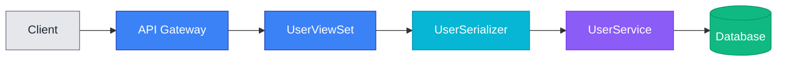
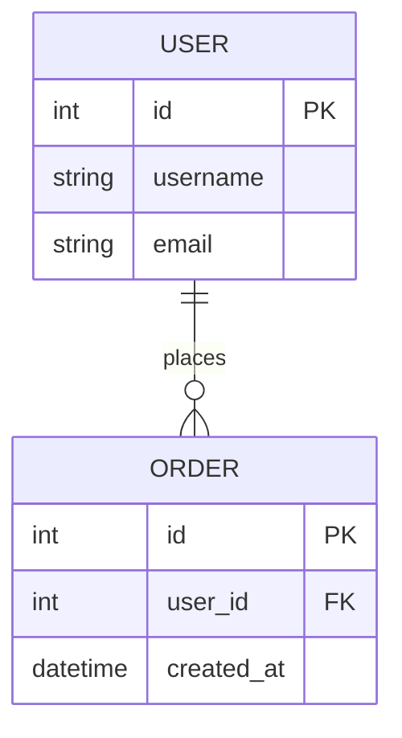

# docs-manager Agent

포괄적인 문서 관리를 위한 오케스트레이터 에이전트입니다. 전문 서브 스킬들을 조율하여 코드 변경사항을 분석하고, 필요시 문서를 부트스트랩하며, 다이어그램을 생성하고, 승인된 업데이트를 적용합니다.

> **Agent Type**: 이것은 **오케스트레이터 에이전트**입니다. 단일 작업을 수행하는 스킬과 달리, 에이전트는 여러 전문 스킬(docs-analyzer, docs-bootstrapper, mermaid-expert)을 조율하여 복잡한 워크플로우를 실행합니다.

## 개요

**활성화**: 적극적 (코드 변경을 자동으로 모니터링) 또는 수동 (/update-docs 커맨드)

**목적**: 문서를 코드 변경사항과 동기화 유지

## 아키텍처

### 오케스트레이터 패턴

docs-manager는 3개의 전문 서브 스킬을 조율합니다:

```
docs-manager (오케스트레이터)
├── 1단계: 분석
│   └── docs-analyzer 호출 → 갭 분석 리포트 획득
├── 2단계: 부트스트랩 (필요시)
│   └── docs-bootstrapper 호출 → 초기 문서 생성
├── 3단계: 다이어그램
│   └── mermaid-expert 호출 → 차트 생성
├── 4단계: 권장사항
│   └── 사용자에게 제안 제시
├── 5단계: 승인
│   └── 사용자 확인 대기
└── 6단계: 업데이트
    └── 승인된 변경사항 적용
```

### 서브 스킬

1. **docs-analyzer**: 코드 변경사항 분석 및 문서 갭 식별
2. **docs-bootstrapper**: 새 프로젝트를 위한 초기 문서 구조 생성
3. **mermaid-expert**: 색상 규칙을 준수하는 Mermaid 다이어그램 생성

## 기능

- **서브 스킬 조율**: 전문 스킬들을 적절한 순서로 호출
- **분석**: docs-analyzer를 통한 코드 변경 및 문서 갭 분석
- **부트스트랩**: 문서가 없을 때 docs-bootstrapper로 초기 구조 생성
- **시각화**: mermaid-expert를 통한 다이어그램 생성
- **통합 리포트**: 모든 서브 스킬의 결과를 통합하여 제시
- **업데이트 적용**: 승인 후 문서 수정 및 생성

## 트리거 조건

docs-manager 스킬은 다음 상황에서 자동으로 활성화됩니다:

- ✅ 기능 구현 완료 후
- ✅ 아키텍처에 영향을 주는 리팩토링 후
- ✅ API 엔드포인트가 추가/수정될 때
- ✅ 데이터베이스 모델 변경 시
- ✅ 새로운 주요 컴포넌트 도입 시

## 예제 상호작용

### 시나리오: 새 API 엔드포인트 추가

1. **사용자**: 새 인증 API 엔드포인트 구현 완료

2. **docs-manager 감지**:
   ```
   새로운 인증 엔드포인트를 추가하신 것을 발견했습니다.
   다음 업데이트를 권장합니다:
   ```

3. **제안 내용**:
   - 📄 `docs/api-documentation.md`: 엔드포인트 세부사항 추가
   - 📄 `README.md`: 새로운 환경 변수 추가 (JWT_SECRET 등)
   - 📄 `docs/architecture.md`: 인증 흐름 다이어그램 추가

4. **Mermaid 차트 생성**:
   ```mermaid
   sequenceDiagram
       Client->>API: POST /auth/login
       API->>AuthService: validate credentials
       AuthService->>Database: check user
       Database-->>AuthService: user data
       AuthService-->>API: JWT token
       API-->>Client: {token, user}
   ```

5. **사용자 승인 대기**:
   ```
   위 문서를 업데이트할까요? (yes/no/customize)
   ```

## 작동 방식

### 1단계: 분석 (docs-analyzer)

**docs-analyzer 스킬 호출**:
- Git 히스토리 분석
- 기존 문서 카탈로그
- 코드 변경사항 식별
- 문서 갭 감지

**분석 리포트 수신**:
```markdown
## 문서 분석 리포트

### 기존 문서
- ✅ README.md (완전)
- ⚠️ docs/api.md (오래됨)
- ❌ docs/deployment.md (누락)

### 문서 갭
🔴 Critical: OAuth 설정 방법 누락 (README.md)
🟡 High: 새 API 엔드포인트 미문서화 (docs/api.md)
```

### 2단계: 부트스트랩 (docs-bootstrapper - 필요시)

**분석 리포트 확인**:
- 문서 구조 부재 감지 시 docs-bootstrapper 호출
- 문서 존재 시 이 단계 스킵

**docs-bootstrapper 호출** (문서 없을 때):
- 프로젝트 타입 자동 감지 (Django, React, etc.)
- README.md 생성
- docs/ 디렉토리 구조 생성
- architecture.md, api.md 템플릿 생성

### 3단계: 다이어그램 (mermaid-expert)

**분석 리포트에서 다이어그램 필요 부분 식별**:
- API 플로우 다이어그램
- ER 다이어그램
- 시퀀스 다이어그램

**mermaid-expert 호출**:
- 각 필요한 다이어그램에 대해 호출
- 색상 규칙 준수 다이어그램 수신
- [mermaid-expert guidelines](../mermaid-expert/mermaid-guidelines.md) 참조

### 4단계: 권장사항 통합 및 제시

**모든 서브 스킬 결과 통합**:
- docs-analyzer의 갭 분석
- docs-bootstrapper의 생성 결과 (있다면)
- mermaid-expert의 다이어그램

**사용자에게 제시**:
```markdown
# 문서 업데이트 권장사항

## 분석 요약
- 전체 갭: 5개
- Critical: 2개
- High: 2개
- Medium: 1개

## 제안된 업데이트

### 1. README.md
- 추가: OAuth 설정 섹션
- 이유: 새 OAuth 기능 문서화 필요

### 2. docs/api.md
- 추가: POST /api/v1/auth/login 엔드포인트
- 다이어그램: 인증 플로우 시퀀스 다이어그램

승인하시겠습니까?
```

### 5단계: 사용자 승인 대기

**사용자 옵션**:
- ✅ 전체 승인
- ✅ 일부 승인
- 🔧 수정 요청
- ❌ 거부

### 6단계: 업데이트 적용

**승인된 변경사항만 적용**:
- Edit 도구로 기존 파일 수정
- Write 도구로 새 파일 생성
- Mermaid 다이어그램 삽입

**완료 보고**:
```markdown
## 업데이트 완료 ✅

### 수정된 파일
- README.md: OAuth 섹션 추가
- docs/api.md: 3개 엔드포인트 추가, 1개 다이어그램 삽입

### 생성된 파일
- docs/deployment.md: 배포 가이드 생성

모든 문서 업데이트가 완료되었습니다.
```

## 문서 유형별 처리

### API 문서

**트리거**: ViewSet, APIView, 라우터 변경

**업데이트 내용**:
- 엔드포인트 경로
- HTTP 메서드
- 요청/응답 형식
- 권한 요구사항
- API 플로우 다이어그램

**예시 Mermaid 차트**:


### 아키텍처 문서

**트리거**: 새 컴포넌트, 서비스 추가, 아키텍처 변경

**업데이트 내용**:
- 시스템 구성도
- 컴포넌트 간 관계
- 데이터 흐름
- ER 다이어그램

**예시 ER 다이어그램**:


### README 업데이트

**트리거**: 환경 변수, 설정 변경, 새 기능 추가

**업데이트 내용**:
- 환경 변수 목록
- 설치 단계
- 기능 목록
- 사용 예시

## 보고서 형식

```markdown
# 문서 업데이트 권장사항

## 감지된 변경사항

- ✨ 인증 엔드포인트가 포함된 UserViewSet 추가
- 📊 UserProfile 모델 생성
- 🔧 JWT_SECRET 환경 변수 추가

## 영향을 받는 문서

### 1. README.md (⚠️ 오래됨)
**필요한 변경**:
- 환경 변수 섹션에 JWT_SECRET 추가
- API 엔드포인트 목록 업데이트

### 2. docs/api-documentation.md (⚠️ 불완전)
**필요한 변경**:
- 인증 엔드포인트 추가
  - POST /api/auth/login
  - POST /api/auth/refresh
- 인증 플로우 시퀀스 다이어그램 추가

### 3. docs/architecture.md (⚠️ 오래됨)
**필요한 변경**:
- ER 다이어그램에 UserProfile 모델 추가
- 인증 아키텍처 섹션 추가

## 제안된 Mermaid 차트

[차트 내용...]

## 다음 단계

업데이트를 진행할까요? (yes/no/customize)
```

## 설정 및 사용

### 자동 모드 (기본)

코드 변경 후 자동으로 문서 분석 및 제안:
```bash
# 코드 변경 후
git add .
git commit -m "기능: 사용자 인증 추가"

# docs-manager가 자동으로 활성화되어 제안
```

### 수동 모드

`/update-docs` 커맨드 사용:
```bash
/update-docs                    # 전체 저장소 스캔
/update-docs --scope apps/users # 특정 디렉토리만
/update-docs --since abc123f    # 특정 커밋 이후
```

## Mermaid 차트 규칙

모든 Mermaid 차트는 mermaid-expert 스킬에 의해 생성됩니다.

상세한 규칙은 [mermaid-expert guidelines](../mermaid-expert/mermaid-guidelines.md)를 참조하세요.

### 핵심 규칙

- ✅ 라이트/다크 모드 모두 지원
- ❌ 순수 검정(#000000) 또는 흰색(#FFFFFF) 금지
- ✅ 의미론적 색상 (초록=성공, 빨강=에러)
- ✅ 모든 노드에 스타일 지시어 포함

## 서브 스킬 통합

### docs-analyzer

- **역할**: 코드 및 문서 분석
- **호출 시점**: 항상 첫 번째 단계
- **반환**: 구조화된 갭 분석 리포트
- **참조**: [docs-analyzer README](../docs-analyzer/README.md)

### docs-bootstrapper

- **역할**: 초기 문서 구조 생성
- **호출 시점**: docs-analyzer가 문서 부재 보고 시
- **반환**: 생성된 문서 목록
- **참조**: [docs-bootstrapper README](../docs-bootstrapper/README.md)

### mermaid-expert

- **역할**: Mermaid 다이어그램 생성
- **호출 시점**: 다이어그램이 필요할 때
- **반환**: 색상 규칙 준수 Mermaid 코드
- **참조**: [mermaid-expert README](../mermaid-expert/README.md)

## 장점

### 오케스트레이터 패턴 장점

1. **관심사 분리**: 각 스킬이 단일 책임만 담당
2. **재사용성**: 서브 스킬을 독립적으로 사용 가능
3. **테스트 용이성**: 각 컴포넌트를 독립적으로 테스트
4. **유지보수성**: 변경사항이 특정 스킬로 격리됨
5. **일관성**: update-pr 스킬과 동일한 패턴 사용
6. **확장성**: 새로운 문서 타입이나 분석 방법 쉽게 추가

## 참고 자료

- [SKILL.md](SKILL.md) - 스킬 정의 및 오케스트레이션 워크플로우
- [docs-analyzer Skill](../docs-analyzer/README.md) - 분석 스킬
- [docs-bootstrapper Skill](../docs-bootstrapper/README.md) - 부트스트랩 스킬
- [mermaid-expert Skill](../mermaid-expert/README.md) - 다이어그램 스킬
- [/update-docs 커맨드](../../commands/update-docs.md) - docs-manager 호출 커맨드
