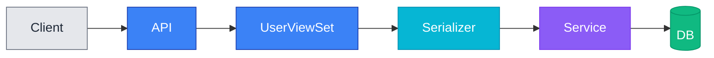
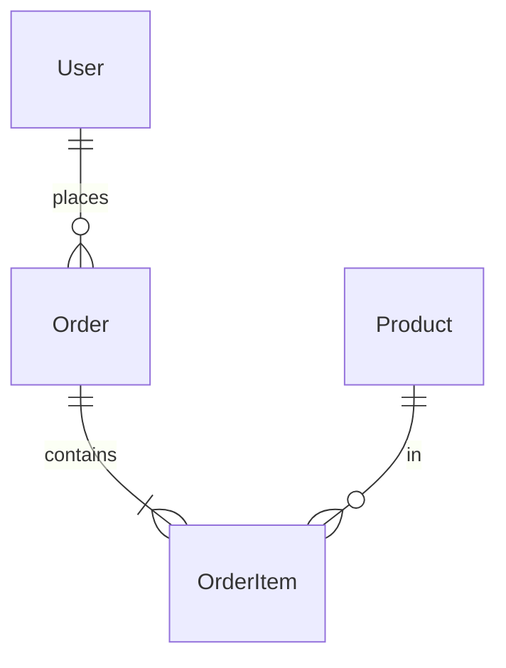
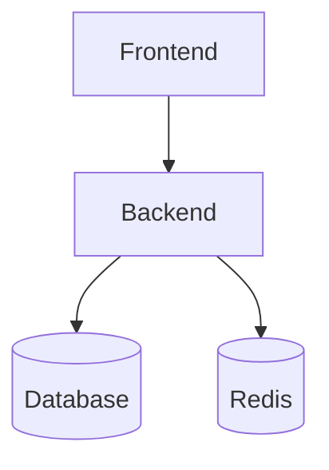

# Update Documentation Command

You will help the user identify and update documentation that has become outdated due to recent code changes.

## Usage

```bash
/update-docs
/update-docs --scope <path>
/update-docs --since <commit-hash>
```

## Options

- `--scope <path>`: Limit analysis to specific directory (e.g., `--scope apps/users`)
- `--since <commit>`: Analyze changes since specific commit (default: last 10 commits)

## Purpose

This command triggers the docs-manager agent to:
1. Scan the repository for documentation files
2. Analyze recent code changes
3. Identify documentation that needs updates
4. Generate or update Mermaid charts for architectural changes
5. Present recommendations to the user
6. Update documentation files after user approval

## Implementation Steps

### Step 1: Parse Options

Extract optional parameters:
- `scope`: Specific directory to analyze (default: entire repository)
- `since`: Commit hash to start analysis from (default: last 10 commits)

### Step 2: Scan Documentation Files

Find all documentation files in the repository:

```bash
# Find markdown files
find . -name "*.md" -not -path "./node_modules/*" -not -path "./.git/*"

# Common documentation locations
- README.md
- docs/**/*.md
- CONTRIBUTING.md
- ARCHITECTURE.md
- API_DOCUMENTATION.md
- CHANGELOG.md
- */README.md (component-level docs)
```

Use Glob tool:
```
**/*.md
docs/**/*
```

### Step 3: Analyze Recent Changes

Get recent commits and changed files:

```bash
# Get recent commits
git log --since=<since> --oneline --name-status

# Or last N commits if no since provided
git log -10 --oneline --name-status

# Get changed files in scope
git diff <since>..HEAD --name-only <scope>
```

**Categorize changes**:
- **Models**: `models.py`, `apps/*/models/`
- **Views/ViewSets**: `views.py`, `viewsets.py`
- **Serializers**: `serializers.py`
- **APIs**: Endpoint additions/modifications
- **Services**: Business logic in `services/`
- **Configuration**: `settings.py`, `.env.example`
- **Database**: Migration files
- **Tests**: `tests/`, `test_*.py`

### Step 4: Identify Documentation Gaps

Compare code changes with documentation:

**API Changes → API Documentation**:
- New/modified ViewSets should be documented in API docs
- Request/response formats should be explained
- Authentication requirements should be stated

**Model Changes → Architecture Documentation**:
- New models should be in architecture/data model docs
- Relationship changes should update ER diagrams
- Field additions should be documented

**Configuration Changes → Setup Documentation**:
- New environment variables should be in README or setup guide
- Configuration options should be documented
- Deployment steps should be updated

**Service Layer Changes → Architecture Documentation**:
- New services should be in architecture docs
- Business logic flows should have flowcharts
- Component interactions should be visualized

### Step 5: Generate Mermaid Charts

For architectural changes, generate appropriate diagrams:

#### New API Endpoints


#### Model Relationships


#### System Architecture Updates


Use mermaid-expert skill (invoked by docs-manager agent) for proper styling.

### Step 6: Present Recommendations

Create a summary report:

```markdown
# Documentation Update Recommendations

## Changes Detected

### Code Changes (since <commit>)
- Added UserViewSet with authentication endpoints
- Created UserProfile model with email verification
- Modified Order model to include shipping address
- Added Celery task for email notifications

## Affected Documentation

### 1. README.md
**Status**: ⚠️ Outdated
**Reason**: New environment variables required (EMAIL_* settings)
**Recommended Updates**:
- Add EMAIL_BACKEND configuration to setup section
- Update environment variables table
- Add email service setup instructions

### 2. docs/api-documentation.md
**Status**: ⚠️ Incomplete
**Reason**: New authentication endpoints not documented
**Recommended Updates**:
- Add /api/v1/auth/login/ endpoint documentation
- Add /api/v1/auth/register/ endpoint documentation
- Include request/response examples
- Add authentication flow diagram

### 3. docs/architecture.md
**Status**: ⚠️ Outdated
**Reason**: New UserProfile model not in data model section
**Recommended Updates**:
- Update ER diagram to include UserProfile
- Document User-UserProfile relationship
- Add email verification flow diagram

### 4. CHANGELOG.md
**Status**: ✅ Up to date
**Reason**: No changes needed

## Proposed Mermaid Charts

### Chart 1: Authentication Flow (for API docs)
[Generated Mermaid diagram]

### Chart 2: Updated Data Model (for Architecture docs)
[Generated Mermaid ER diagram]

## Actions

1. Update README.md (Add environment variables section)
2. Update docs/api-documentation.md (Add authentication endpoints)
3. Update docs/architecture.md (Add UserProfile model, ER diagram)
4. Generate CHANGELOG entry for version X.Y.Z

Would you like me to proceed with these updates? (yes/no/customize)
```

### Step 7: Wait for User Approval

Present the report and wait for user decision:
- **Yes**: Proceed with all recommended updates
- **No**: Cancel operation
- **Customize**: User specifies which updates to make

### Step 8: Apply Updates

After approval, update documentation files:

1. **Read existing file**
2. **Identify insertion points**:
   - For new sections: Append or insert in appropriate location
   - For updates: Find and replace relevant sections
   - For diagrams: Insert after appropriate heading
3. **Make changes** using Edit or Write tool
4. **Verify formatting** (proper markdown, no broken links)

### Step 9: Report Completion

Summarize what was updated:

```markdown
✅ Documentation Updated

Files Modified:
1. README.md
   - Added EMAIL_* environment variables to setup section
   - Updated prerequisites

2. docs/api-documentation.md
   - Added authentication endpoints section
   - Included request/response examples
   - Added authentication flow Mermaid diagram

3. docs/architecture.md
   - Updated ER diagram with UserProfile model
   - Added email verification flow diagram

Mermaid Charts Created:
- Authentication flow diagram (API docs)
- Updated data model ER diagram (Architecture docs)

Next Steps:
- Review changes: `git diff`
- Commit changes: `git add . && git commit -m "docs: Update documentation for authentication feature"`
```

## Examples

### Example 1: Full Repository Scan

```bash
/update-docs
```

Scans entire repository, analyzes last 10 commits, identifies all outdated documentation.

### Example 2: Specific Directory

```bash
/update-docs --scope apps/users
```

Only analyzes changes in `apps/users/` directory and updates related documentation.

### Example 3: Since Specific Commit

```bash
/update-docs --since abc123f
```

Analyzes changes since commit `abc123f`, useful after major feature development.

## Best Practices

### When to Use This Command

- After completing a major feature
- After significant refactoring
- Before creating a pull request
- After merging multiple changes
- During documentation review cycles

### Documentation Principles

- **Accuracy**: Documentation must match current code
- **Completeness**: All public APIs should be documented
- **Clarity**: Use diagrams to explain complex flows
- **Maintainability**: Keep documentation close to code

### Mermaid Chart Guidelines

- Use standardized color palette (from mermaid-expert skill)
- Ensure light/dark mode compatibility
- Keep diagrams simple and focused
- Include legends if necessary

## Error Handling

- **No recent changes**: "No significant code changes detected in the specified scope."
- **No documentation found**: "No markdown documentation files found in repository."
- **Git not available**: "Git repository required. Please ensure you're in a git repository."
- **No changes needed**: "✅ All documentation is up to date."

## Dependencies

- Git repository with commit history
- Read/Write file access
- Glob and Grep tools for file scanning
- docs-manager agent for orchestrating the documentation workflow
- docs-analyzer skill (invoked by docs-manager) for gap analysis
- docs-bootstrapper skill (invoked by docs-manager) for initial structure
- mermaid-expert skill (invoked by docs-manager) for chart generation

## Integration with Other Tools

This command works in conjunction with:
- **[docs-manager agent](../agents/docs-manager/)**: Orchestrates the complete documentation workflow
- **[docs-analyzer skill](../skills/docs-analyzer/)**: Analyzes code changes and identifies documentation gaps
- **[docs-bootstrapper skill](../skills/docs-bootstrapper/)**: Generates initial documentation structure
- **[mermaid-expert skill](../skills/mermaid-expert/)**: Generates properly styled diagrams
- **update-pr-desc command**: Can reference updated documentation in PR descriptions
