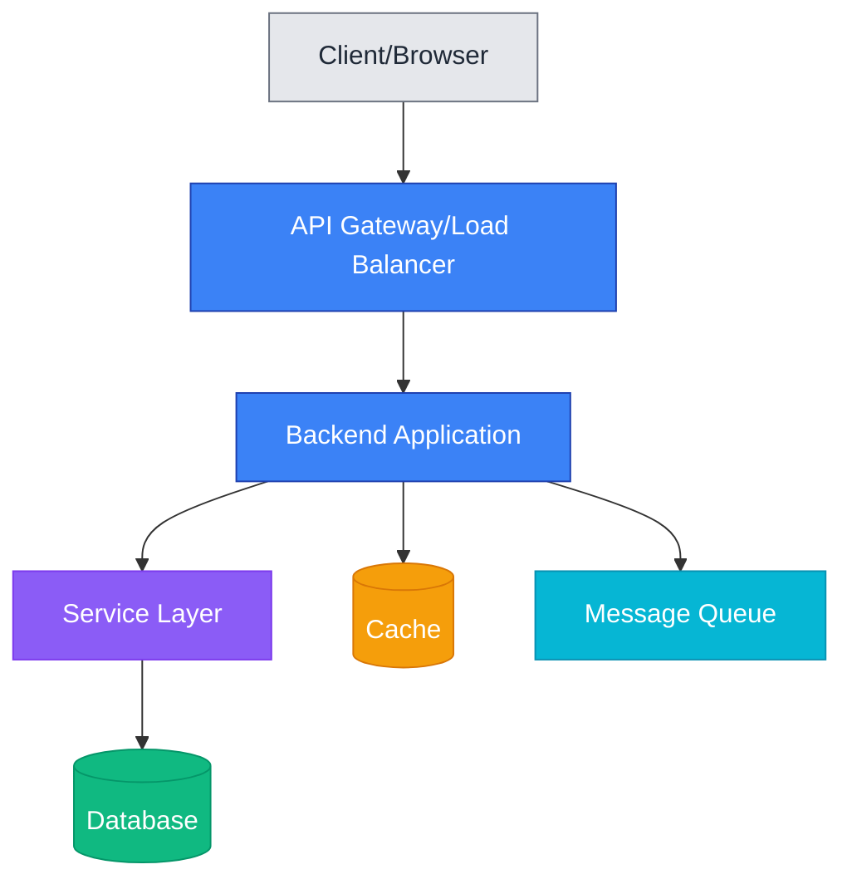
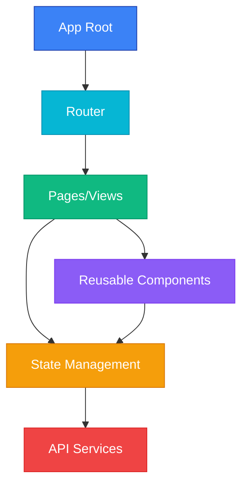
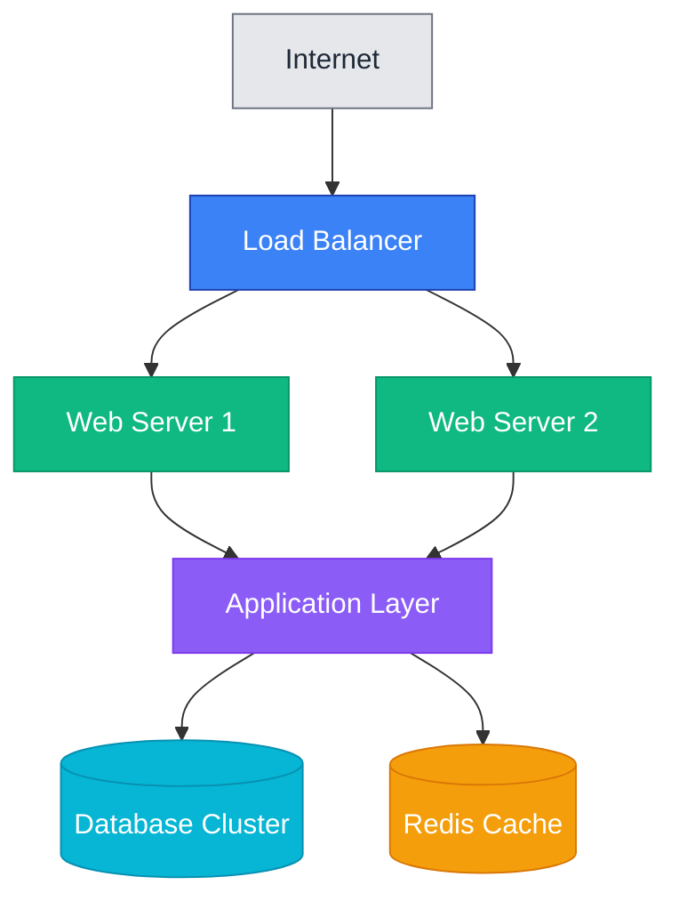
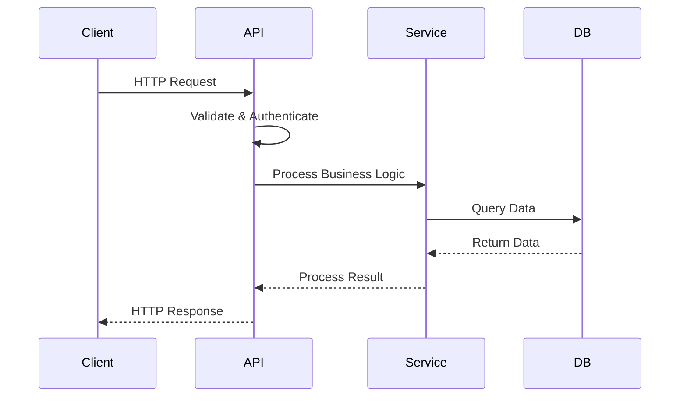

# Architecture Documentation

> {{PROJECT_NAME}} 시스템 아키텍처 문서

## 📋 목차

1. [시스템 개요](#시스템-개요)
2. [아키텍처 다이어그램](#아키텍처-다이어그램)
3. [주요 컴포넌트](#주요-컴포넌트)
4. [데이터 플로우](#데이터-플로우)
5. [기술 스택](#기술-스택)
6. [설계 결정](#설계-결정)

## 🎯 시스템 개요

{{PROJECT_NAME}}은(는) {{ARCHITECTURE_PATTERN}} 아키텍처 패턴을 따르는 {{PROJECT_TYPE}} 프로젝트입니다.

### 핵심 목표

- [목표 1]: [설명]
- [목표 2]: [설명]
- [목표 3]: [설명]

### 주요 특징

- **확장성**: [확장성 관련 설명]
- **성능**: [성능 관련 설명]
- **보안**: [보안 관련 설명]
- **유지보수성**: [유지보수성 관련 설명]

## 📊 아키텍처 다이어그램

### 시스템 구조 [Backend Projects]

### 컴포넌트 구조 [Frontend Projects]

### 배포 아키텍처 [Infrastructure Projects]

**참고**: 위 다이어그램은 템플릿입니다. 실제 프로젝트 구조에 맞게 수정하세요.

## 🧩 주요 컴포넌트

### [Backend Projects - Django Example]

#### 1. API Layer
- **역할**: HTTP 요청 처리, 라우팅
- **기술**: {{FRAMEWORK}} (Django REST Framework)
- **주요 파일**:
  - `views.py`: ViewSet 및 API 뷰
  - `urls.py`: URL 라우팅
  - `serializers.py`: 직렬화/역직렬화

#### 2. Service Layer
- **역할**: 비즈니스 로직 처리
- **위치**: `services/` 디렉토리
- **책임**:
  - 복잡한 비즈니스 규칙 구현
  - 다중 모델 조율
  - 외부 API 통합

#### 3. Data Layer
- **역할**: 데이터 저장 및 조회
- **기술**: Django ORM + {{DATABASE}}
- **주요 파일**: `models.py`

#### 4. Authentication & Authorization
- **역할**: 사용자 인증 및 권한 관리
- **기술**: [JWT / OAuth / Session 등]
- **구현**: [인증 방식 설명]

### [Frontend Projects - React Example]

#### 1. Pages/Views
- **역할**: 라우트별 페이지 컴포넌트
- **위치**: `src/pages/`
- **예시**: HomePage, UserProfilePage, DashboardPage

#### 2. Components
- **역할**: 재사용 가능한 UI 컴포넌트
- **위치**: `src/components/`
- **분류**:
  - Common: 공통 컴포넌트 (Button, Input, Modal)
  - Feature: 기능별 컴포넌트

#### 3. State Management
- **역할**: 전역 상태 관리
- **기술**: {{STATE_MANAGEMENT}} (Redux/Zustand/Context)
- **구조**:
  - Actions: 상태 변경 액션
  - Reducers: 상태 업데이트 로직
  - Selectors: 상태 조회

#### 4. API Services
- **역할**: 백엔드 API 통신
- **위치**: `src/services/api/`
- **기술**: Axios / Fetch API

### [Infrastructure Projects - Terraform Example]

#### 1. Network Layer
- **역할**: VPC, 서브넷, 라우팅
- **파일**: `network.tf`

#### 2. Compute Layer
- **역할**: EC2, ECS, Lambda 등
- **파일**: `compute.tf`

#### 3. Data Layer
- **역할**: RDS, DynamoDB, S3 등
- **파일**: `data.tf`

## 🔄 데이터 플로우

### [Backend - Request/Response Flow]

### [Frontend - State Management Flow]

```mermaid
flowchart LR
    User[User Action] --> Dispatch[Dispatch Action]
    Dispatch --> Reducer[Reducer]
    Reducer --> Store[Update Store]
    Store --> Component[Re-render Component]
    Component --> UI[Update UI]

    style User fill:#e5e7eb,stroke:#6b7280,color:#1f2937
    style Dispatch fill:#3b82f6,stroke:#1e40af,color:#ffffff
    style Reducer fill:#8b5cf6,stroke:#7c3aed,color:#ffffff
    style Store fill:#f59e0b,stroke:#d97706,color:#ffffff
    style Component fill:#10b981,stroke:#059669,color:#ffffff
    style UI fill:#06b6d4,stroke:#0891b2,color:#ffffff
```

### 주요 데이터 플로우 시나리오

#### 시나리오 1: [예: 사용자 로그인]
1. 클라이언트가 로그인 요청 전송
2. API가 자격 증명 검증
3. 인증 성공 시 토큰 생성
4. 토큰을 클라이언트에 반환
5. 클라이언트가 토큰 저장 및 사용

#### 시나리오 2: [예: 데이터 조회]
1. 클라이언트가 데이터 요청
2. API가 요청 검증 및 인증 확인
3. 서비스 레이어에서 비즈니스 로직 처리
4. 데이터베이스에서 데이터 조회
5. 결과를 직렬화하여 클라이언트에 반환

## 🛠️ 기술 스택

### Backend [for backend projects]
- **언어**: {{LANGUAGE}} {{LANGUAGE_VERSION}}
- **프레임워크**: {{FRAMEWORK}}
- **데이터베이스**: {{DATABASE}}
- **ORM**: {{ORM}}
- **캐싱**: {{CACHE}} (Redis/Memcached) [OPTIONAL]
- **메시지 큐**: {{MESSAGE_QUEUE}} (RabbitMQ/Celery) [OPTIONAL]
- **API 문서**: {{API_DOCS_TOOL}} (Swagger/OpenAPI) [OPTIONAL]

### Frontend [for frontend projects]
- **언어**: {{LANGUAGE}} (JavaScript/TypeScript)
- **프레임워크**: {{FRAMEWORK}}
- **상태 관리**: {{STATE_MANAGEMENT}}
- **라우팅**: {{ROUTING}}
- **스타일링**: {{STYLING}} (CSS-in-JS/Tailwind/SCSS)
- **빌드 도구**: {{BUILD_TOOL}} (Webpack/Vite)

### Infrastructure [for all projects]
- **컨테이너**: Docker, Docker Compose [OPTIONAL]
- **오케스트레이션**: Kubernetes [OPTIONAL]
- **CI/CD**: {{CI_CD_TOOL}} (GitHub Actions/GitLab CI) [OPTIONAL]
- **모니터링**: {{MONITORING_TOOL}} [OPTIONAL]
- **로깅**: {{LOGGING_TOOL}} [OPTIONAL]

### 개발 도구
- **버전 관리**: Git
- **패키지 관리**: {{PACKAGE_MANAGER}}
- **테스트**: {{TEST_FRAMEWORK}}
- **린터**: {{LINTER}}
- **포맷터**: {{FORMATTER}}

## 🎯 설계 결정

### 결정 1: [예: 아키텍처 패턴 선택]

**결정**: {{ARCHITECTURE_PATTERN}} 패턴 사용

**이유**:
- [이유 1]: [설명]
- [이유 2]: [설명]
- [이유 3]: [설명]

**트레이드오프**:
- ✅ **장점**: [장점 설명]
- ⚠️ **단점**: [단점 설명]

**대안**:
- 대안 1: [설명 및 채택하지 않은 이유]
- 대안 2: [설명 및 채택하지 않은 이유]

### 결정 2: [예: 데이터베이스 선택]

**결정**: {{DATABASE}} 사용

**이유**:
- [이유 1]
- [이유 2]

**트레이드오프**:
- ✅ **장점**: [장점]
- ⚠️ **단점**: [단점]

### 결정 3: [예: 상태 관리 라이브러리]

**결정**: {{STATE_MANAGEMENT}} 사용

**이유**:
- [이유]

**트레이드오프**:
- ✅ **장점**: [장점]
- ⚠️ **단점**: [단점]

## 🔒 보안 고려사항

- **인증**: [인증 방식 및 보안 조치]
- **인가**: [권한 관리 방식]
- **데이터 보호**: [암호화, HTTPS 등]
- **입력 검증**: [XSS, SQL Injection 방지]
- **비밀 관리**: [환경 변수, Secrets Manager]

## 📈 성능 최적화

- **캐싱 전략**: [캐싱 사용 방법]
- **데이터베이스 최적화**: [인덱스, 쿼리 최적화]
- **코드 분할**: [Lazy Loading, Code Splitting] [Frontend]
- **CDN 사용**: [정적 자산 배포] [OPTIONAL]

## 🔄 확장성

- **수평 확장**: [Load Balancing, Auto Scaling]
- **수직 확장**: [리소스 증설 전략]
- **데이터베이스 확장**: [Replication, Sharding] [OPTIONAL]
- **마이크로서비스**: [향후 분리 계획] [OPTIONAL]

## 📚 참고 자료

- [프레임워크 공식 문서]
- [아키텍처 패턴 참고 자료]
- [Best Practices 가이드]

---

**참고**:
- 이 문서는 docs-bootstrapper에 의해 자동 생성되었습니다.
- 실제 프로젝트 아키텍처에 맞게 업데이트해주세요.
- Mermaid 다이어그램은 실제 구조를 반영하도록 수정하세요.
