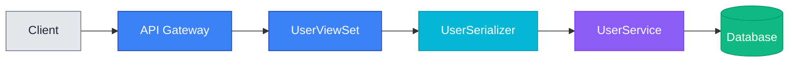
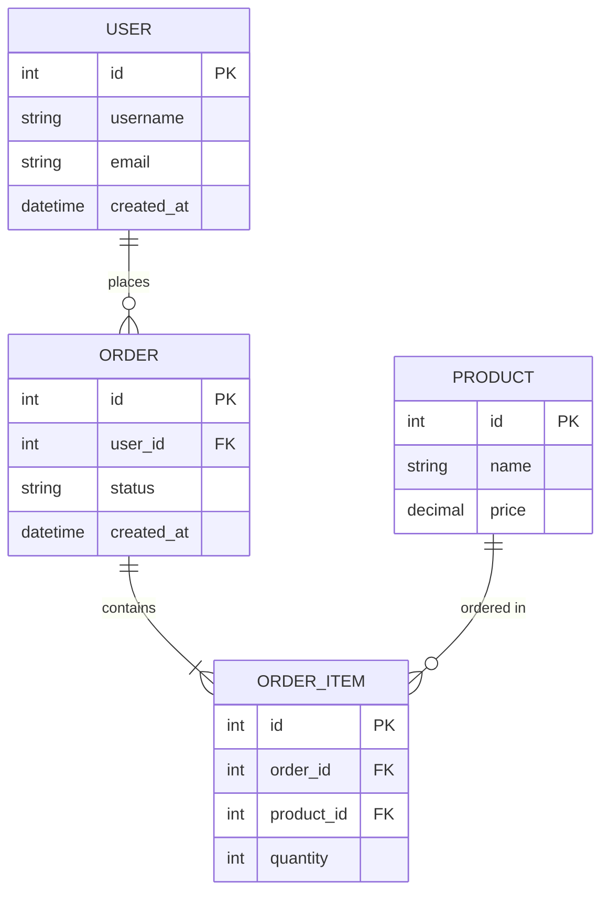
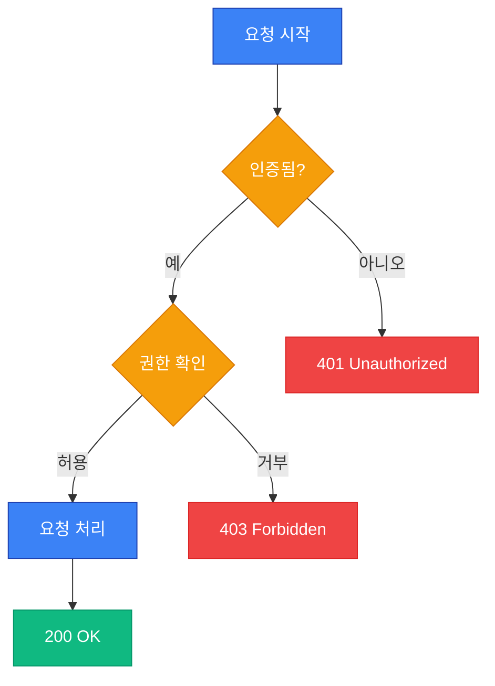
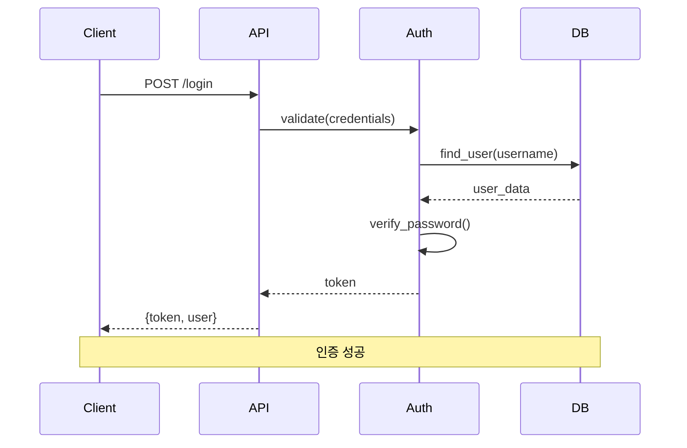
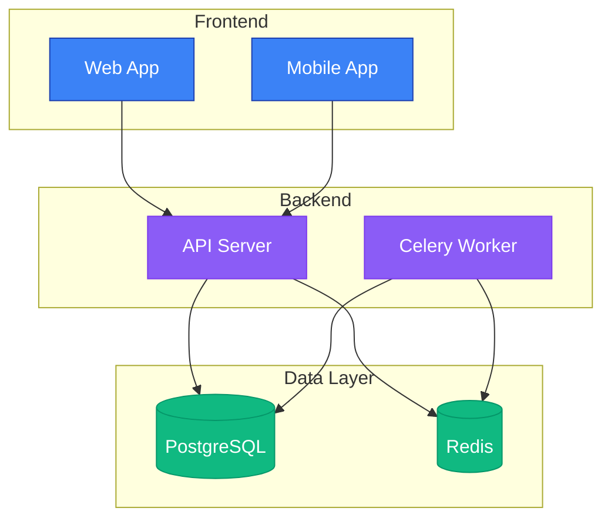
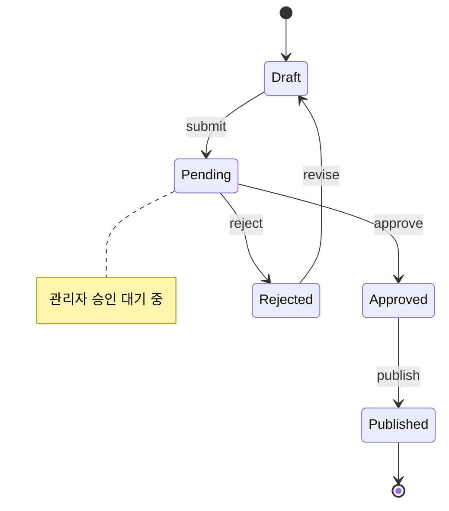
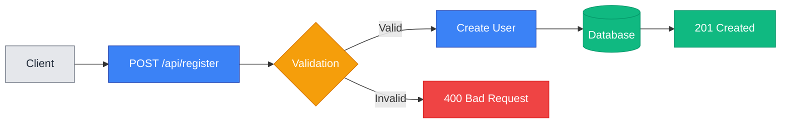
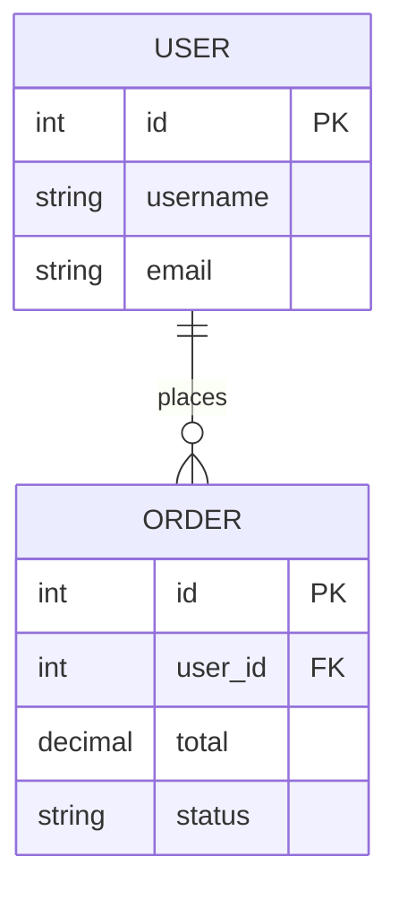

# mermaid-expert Skill

라이트/다크 모드 호환 Mermaid 다이어그램을 생성하는 전문 스킬입니다.

## 개요

**활성화**: 수동 호출 또는 다른 스킬에 의해 호출

**목적**: 엄격한 색상 규칙을 따르는 전문적인 Mermaid 다이어그램 생성

## 기능

- **라이트/다크 모드 호환 색상**
- **템플릿 제공**: 일반적인 다이어그램 유형별 템플릿
- **의미론적 색상**: 직관적인 색상 사용 (초록=성공, 빨강=에러)

## 지원하는 다이어그램 유형

### 1. API 엔드포인트 흐름

Client → API → ViewSet → Service → Database



### 2. ER 다이어그램

데이터베이스 스키마 시각화



### 3. 프로세스 플로우차트

의사결정 흐름 및 비즈니스 로직



### 4. 시퀀스 다이어그램

컴포넌트 간 상호작용



### 5. 시스템 아키텍처

전체 시스템 구조



### 6. 상태 다이어그램

상태 전이 시각화



## 색상 팔레트

### 기본 색상

| 색상 | Hex | 용도 |
|-----|-----|------|
| **Blue** | `#3b82f6` | 일반 작업, 프로세스 |
| **Green** | `#10b981` | 성공, 완료, 데이터베이스 |
| **Yellow** | `#f59e0b` | 경고, 결정 포인트 |
| **Red** | `#ef4444` | 에러, 실패 |
| **Purple** | `#8b5cf6` | 특수 상태, 서비스 |
| **Cyan** | `#06b6d4` | 정보성 항목, 직렬화 |
| **Gray** | `#6b7280` | 비활성, 외부 요소 |

### 스타일 템플릿

```css
/* 일반 프로세스 */
style NodeName fill:#3b82f6,stroke:#1e40af,color:#ffffff

/* 성공 상태 */
style NodeName fill:#10b981,stroke:#059669,color:#ffffff

/* 결정 포인트 */
style NodeName fill:#f59e0b,stroke:#d97706,color:#ffffff

/* 에러 상태 */
style NodeName fill:#ef4444,stroke:#dc2626,color:#ffffff

/* 특수 상태 */
style NodeName fill:#8b5cf6,stroke:#7c3aed,color:#ffffff

/* 정보 항목 */
style NodeName fill:#06b6d4,stroke:#0891b2,color:#ffffff

/* 외부 시스템 */
style NodeName fill:#e5e7eb,stroke:#6b7280,color:#1f2937
```

## 핵심 규칙

### ✅ 해야 할 것

1. **라이트/다크 모드 모두에서 테스트**
   - 두 테마 모두에서 가독성 확인
   - 대비가 충분한지 검증

2. **의미론적 색상 사용**
   - 초록 = 성공, 완료
   - 빨강 = 에러, 실패
   - 노랑 = 경고, 결정
   - 파랑 = 일반 프로세스

3. **모든 노드에 스타일 지정**
   - 각 노드마다 명시적인 스타일
   - 일관된 패턴 유지

4. **적절한 테두리 색상**
   - 채우기 색상보다 어두운 테두리
   - 시각적 계층 구조 제공

### ❌ 하지 말아야 할 것

1. **순수 검정/흰색 사용 금지**
   - ❌ `#000000` (순수 검정)
   - ❌ `#FFFFFF` (순수 흰색)
   - 다크 모드나 라이트 모드에서 보이지 않을 수 있음

2. **스타일 없이 노드 생성 금지**
   - 모든 노드는 명시적 스타일 필요
   - 기본 색상은 테마에 따라 다를 수 있음

3. **임의의 색상 사용 금지**
   - 정의된 팔레트만 사용
   - 일관성 유지

## 사용 예시

### 예시 1: API 엔드포인트 추가

**요청**: "사용자 등록 API 플로우 다이어그램을 만들어주세요"

**응답**:


### 예시 2: 데이터 모델 추가

**요청**: "Order와 User 관계를 보여주는 ER 다이어그램"

**응답**:


## 다른 스킬 및 에이전트와의 통합

### docs-manager Agent에서 호출

docs-manager 에이전트가 문서 업데이트 시 mermaid-expert를 호출하여 차트 생성:

```python
# docs-manager agent 내부
if needs_diagram:
    diagram = call_mermaid_expert(
        type="sequence",
        components=["Client", "API", "Database"],
        description="User authentication flow"
    )
```

### update-pr-desc 커맨드에서 호출

PR 설명에 시각화가 필요할 때 자동 호출:

```python
# PR description generation
if api_changes_detected:
    flow_diagram = mermaid_expert.generate_api_flow(endpoints)
    pr_description += f"\n\n## API Flow\n\n{flow_diagram}"
```

## 검증 체크리스트

차트 생성 후 다음을 확인:

- [ ] 라이트 모드에서 모든 노드가 보이는가?
- [ ] 다크 모드에서 모든 노드가 보이는가?
- [ ] 모든 노드에 스타일이 적용되었는가?
- [ ] 색상이 의미론적으로 적절한가?
- [ ] 순수 검정/흰색을 사용하지 않았는가?
- [ ] 텍스트가 배경과 대비되어 읽기 쉬운가?

## 상세 가이드라인

완전한 Mermaid 차트 작성 규칙 및 예시는 [mermaid-guidelines.md](mermaid-guidelines.md)를 참조하세요.

## 다른 스킬 및 에이전트와의 통합 요약

- **docs-manager agent**: 문서 업데이트 시 다이어그램 생성 (오케스트레이터)
- **docs-bootstrapper skill**: 초기 문서에 다이어그램 플레이스홀더 제공
- **update-pr agent**: PR 설명에 필요한 다이어그램 생성 (오케스트레이터)

## 참고 자료

- [SKILL.md](SKILL.md) - 스킬 정의
- [mermaid-guidelines.md](mermaid-guidelines.md) - 완전한 색상 규칙 및 가이드라인
- [docs-manager Agent](../../agents/docs-manager/README.md) - 오케스트레이터 에이전트
- [Mermaid 공식 문서](https://mermaid.js.org/)
