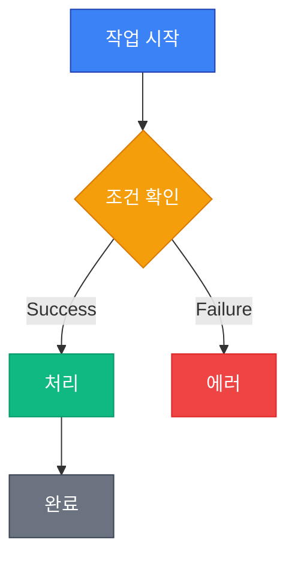
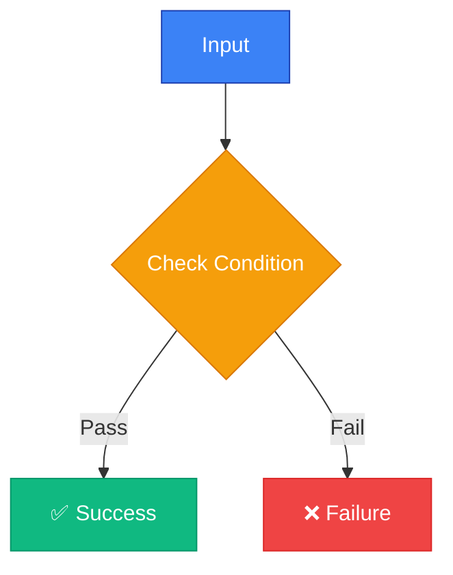
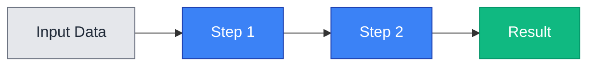
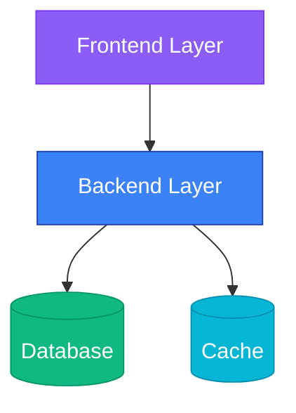

## Mermaid Chart Guidelines

When creating or modifying Mermaid diagrams in documentation, follow these guidelines to ensure visibility in both light and dark modes.

### Light/Dark Mode Compatibility

**CRITICAL RULES:**

- ✅ All Mermaid charts MUST be visible in both light and dark themes
- ❌ NEVER use pure black (`#000000`) or pure white (`#FFFFFF`)
- ✅ Use theme-agnostic color schemes
- ✅ Test charts in both viewing modes before committing

### Recommended Color Palette

Use these standardized colors that work in both light and dark modes:

#### Primary Colors

```
- Blue (Primary):     #3b82f6  (Readable in both modes, default actions)
- Green (Success):    #10b981  (Completion, success states)
- Yellow (Warning):   #f59e0b  (Caution, warnings)
- Red (Error):        #ef4444  (Errors, critical items)
- Purple (Special):   #8b5cf6  (Special states, highlights)
- Cyan (Info):        #06b6d4  (Informational items)
```

#### Neutral Colors

```
- Light Gray:         #e5e7eb  (Light backgrounds)
- Medium Gray:        #6b7280  (Borders, secondary text)
- Dark Gray:          #374151  (Text on light backgrounds)
```

### Color Usage Guidelines

1. **Semantic Color Usage**:
   - Green: Successful operations, completed states
   - Red: Errors, failed states, critical items
   - Yellow: Warnings, pending states
   - Blue: Normal operations, default states
   - Purple: Special cases, optional items

2. **Styling Syntax**:

   ```mermaid
   flowchart TD
       Node1["Example Node"]
       Node2["Success Node"]
       Node3["Warning Node"]

       style Node1 fill:#3b82f6,stroke:#1e40af,color:#ffffff
       style Node2 fill:#10b981,stroke:#059669,color:#ffffff
       style Node3 fill:#f59e0b,stroke:#d97706,color:#ffffff
   ```

3. **Accessibility**:
   - Maintain WCAG AA contrast ratios (4.5:1 for text)
   - Use `color:#ffffff` for text on dark backgrounds
   - Use `color:#1f2937` for text on light backgrounds
   - Combine colors with text labels for colorblind accessibility

### Example: Proper Mermaid Chart



### Best Practices

1. **Always Use Style Directives**: Apply `style` directives at the end of diagrams for custom colors
2. **Consistent Color Scheme**: Use the recommended palette across all documentation
3. **Semantic Colors**: Match colors to meaning (green=success, red=error)
4. **Test Both Modes**: Verify chart visibility in light and dark themes
5. **Keep It Simple**: Don't overuse colors - use them for emphasis
6. **Document Custom Colors**: If using non-standard colors, document the reason

### Common Patterns

#### Decision Tree



#### Process Flow



#### System Architecture



### What to Avoid

❌ **Don't:**

- Use pure black or pure white
- Use default Mermaid theme colors without testing
- Use colors without semantic meaning
- Create charts that rely solely on color to convey information
- Use low-contrast color combinations

✅ **Do:**

- Use the recommended color palette
- Test in both light and dark modes
- Combine colors with text/icons
- Keep color usage consistent
- Document any special color choices
